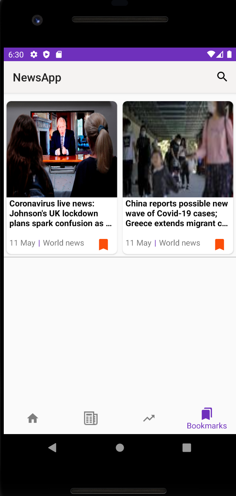

# Android-NewsApp
Android App to display breaking news from Guardian and NYTimes 

## Synopsis

This project was completed as a part of my coursework for the course CSCI 571: Web Technologies at the University of Southern California, Spring 2020 under Prof. Marco Papa.

## Screenshots

    
<h2>HomePage displaying news and current weather</h2>

<h2>Detailed Version of news</h2>

<h2>Section-Wise News</h2>

<h2>Trending Chart </h2>

<h2>Bookmarking functionality</h2>

<h2>Search Results</h2>

  
### Tech Stack of this Project:

* Front-end: Android(Java)
* Dependencies: Guardian News API , NYTimes News API, Twitter API, Facebook API, Trending API, Bing Autosuggest API

## Contributing to Android-NewsApp
<!--- If your README is long or you have some specific process or steps you want contributors to follow, consider creating a separate CONTRIBUTING.md file--->
To contribute to Android-NewsApp, follow these steps:

1. Fork this repository.
2. Create a branch: `git checkout -b <branch_name>`.
3. Make your changes and commit them: `git commit -m '<commit_message>'`
4. Push to the original branch: `git push origin https://github.com/Shraddha2104Android-NewsApp`
5. Create the pull request.

Alternatively see the GitHub documentation on [creating a pull request](https://help.github.com/en/github/collaborating-with-issues-and-pull-requests/creating-a-pull-request).

***Here is a link to a video showing the complete functioning:*** [https://www.youtube.com/watch?v=RA5mbbbszp0&feature=youtu.be](https://www.youtube.com/watch?v=RA5mbbbszp0&feature=youtu.be) 

<h3 align="center"><b>Developed by <a href="https://github.com/Shraddha2104">Shraddha Shaligram</a>.</b></h1>
