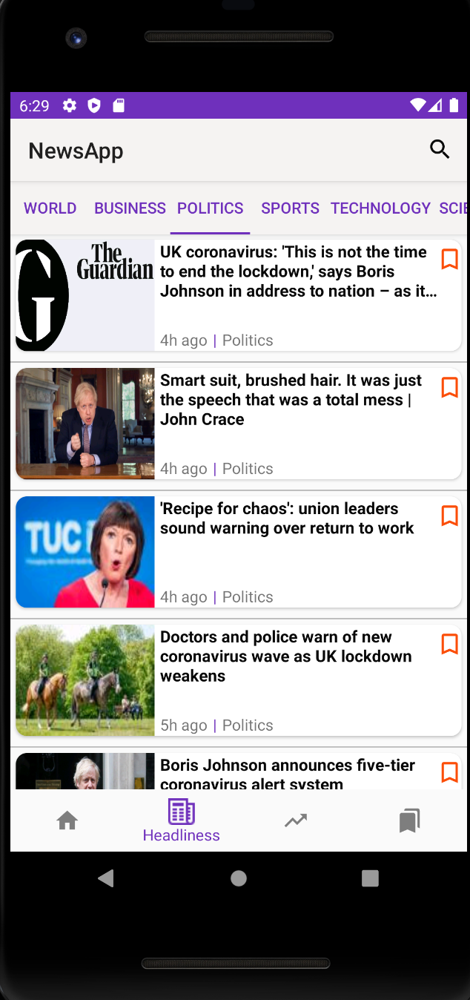

# Android-NewsApp
Android App to display breaking news from Guardian and NYTimes 

      

## Table of Contents
1. [Synopsis](#Synopsis)
2. [Why](#Why)
3. [Installation Guide](#Installation-Guide)
4. [Screenshots](#Screenshots)
5. [Tech Stack of this Project](#Tech-Stack-of-this-Project)
6. [Contributing to Android-NewsApp](#Contributing-to-Android-NewsApp)

## Synopsis

This project was completed as a part of my coursework for the course CSCI 571: Web Technologies at the University of Southern California, Spring 2020 under Prof. Marco Papa.

## Why?

**Problem**: How in the world do you keep track of all hot:fire: news happening around? Way too many! It's like a Russian novel! Help! :astonished:

**Solution**: We stream the news you need and can add them to read-it-later list to read according to your convenience. We'll source, sort, summarize and quantify different news categories

- For people with goldfish memory, who can only keep 7±2 people in their heads at all times! :grimacing:
- For people who're just too lazy for lookups! Sometimes you just want happenings at a glance! :star:
## Installation Guide
The app can be installed and tested in 5 steps:
1. Install [Android Studio](https://developer.android.com/studio) on your machine.
2. Create an [Android Virtual Device (AVD)](https://developer.android.com/studio/run/managing-avds) in your Android Studio.
3. Clone the Android-NewsApp repo to your local machine.
4. Open the cloned local project in Android Studio.
5. Run the app.

## Screenshots

    
<h2>HomePage displaying news and current weather</h2>

<h2>Detailed Version of news</h2>

<h2>Section-Wise News</h2>

<h2>Trending Chart </h2>

<h2>Bookmarking functionality</h2>

<h2>Search Results</h2>

  
### Tech Stack of this Project:

* Front-end: Android(Java)
* Dependencies: Guardian News API , NYTimes News API, Twitter API, Facebook API, Trending API, Bing Autosuggest API

## Contributing to Android-NewsApp
<!--- If your README is long or you have some specific process or steps you want contributors to follow, consider creating a separate CONTRIBUTING.md file--->
To contribute to Android-NewsApp, follow these steps:

1. Fork this repository.
2. Create a branch: `git checkout -b <branch_name>`.
3. Make your changes and commit them: `git commit -m '<commit_message>'`
4. Push to the original branch: `git push origin https://github.com/Shraddha2104Android-NewsApp`
5. Create the pull request.

Alternatively see the GitHub documentation on [creating a pull request](https://help.github.com/en/github/collaborating-with-issues-and-pull-requests/creating-a-pull-request).

***Here is a link to a video showing the complete functioning:*** [https://www.youtube.com/watch?v=RA5mbbbszp0&feature=youtu.be](https://www.youtube.com/watch?v=RA5mbbbszp0&feature=youtu.be) 

## Anything else?

Remember the rules!

It's _not_ about:

- how good your code is,
- how novel the idea is, or
- how useful the project is.

It _is_ about:

- **Impressive**: People's wows are on record!
- **Design**: Slick UI!!!
- **Completion**: No pending functionality, product works!
- **Learning**: GCP, CORS and auth are always tough!
- **OSS practices**: Plentiful commits, branches, PRs!
- **Approved tech**: Many projects integrated into one!
<h3 align="center"><b>Developed by <a href="https://github.com/Shraddha2104">Shraddha Shaligram</a>.</b></h1>
